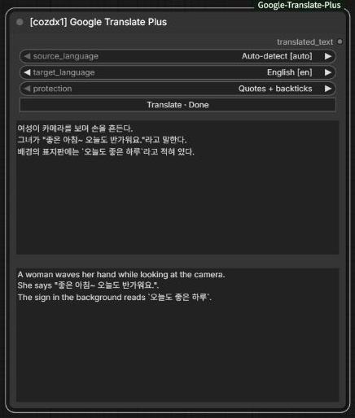

# ComfyUI Google Translate Plus

[English](README.md) | [中文](README.zh-CN.md) | [日本語](README.ja.md) | [한국어](README.ko.md)

Google翻訳でプロンプトを翻訳しながら、台詞や指定した文章をそのまま保持します。原文は編集可能で、直下に読み取り専用の翻訳結果が表示されます。

ノードメニューで `cozdx1` を検索し、**[cozdx1] Google Translate Plus** を追加します。

<p align="center">
  
</p>

<p align="center"><sub>周囲の文は英語に翻訳され、引用符内の台詞とバッククォート内の文章は韓国語のまま保持されます。</sub></p>

## クイックスタート

1. **[cozdx1] Google Translate Plus** を追加します。
2. 原文と翻訳先の言語を選びます。初期設定は **自動検出 → 英語** です。
3. 原文を入力し、`translated_text` 出力をプロンプト入力に接続します。
4. Queueを実行します。翻訳結果は原文の下に表示されます。

Queueで原文を自動翻訳します。**Translate / 翻訳** ボタンは実行前に結果を確認するためのものです。

## 翻訳しない文章

初期設定の **Quotes + backticks** は、次の区間を区切り記号ごと保持します。

- 二重引用符：`"..."`、`“...”`、`「...」`、`『...』`。
- 1個のバッククォートで囲んだ文章、または3個のバッククォートで囲んだ複数行。

台詞には二重引用符、その他の翻訳したくない文章にはバッククォートを使うと便利です。一重引用符は翻訳除外の対象ではありません。

引用符の中でも `(...)` 内の文章は翻訳します。例：`"안녕 (웃으며)"` → `"안녕 (smiling)"`。バッククォート内は括弧の中も含めてすべて保持します。

### テスト用の文章

**自動検出 → 英語**、**Quotes + backticks** で次の文章を貼り付けます。

```text
여성이 카메라를 보며 손을 흔든다.
그녀가 "좋은 아침~ 오늘도 반가워요."라고 말한다.
배경의 표지판에는 `오늘도 좋은 하루`라고 적혀 있다.
```

スクリーンショットの実際の結果です。

```text
A woman waves her hand while looking at the camera.
She says "좋은 아침~ 오늘도 반가워요.".
The sign in the background reads `오늘도 좋은 하루`.
```

| モード | 保持するもの |
| --- | --- |
| `Quotes + backticks` | 二重引用符とバッククォート。 |
| `Quotes only` | 二重引用符。 |
| `Backticks only` | バッククォート。 |
| `None` | 保護せず全体を翻訳。 |

引用符とバッククォートは必ず対で閉じてください。

## インターフェース

- Google翻訳の249の翻訳先言語に対応しています。
- UIはComfyUIの言語設定に従います。英語・中国語・日本語・韓国語に対応しています。
- 結果はワークフローと一緒に保存されます。
- 1回の翻訳は最大5,000文字です。
- モデルのインストールやAPIキーは不要で、VRAMを使用しません。
- インターネット接続が必要です。

## インストール

ComfyUIの `custom_nodes` ディレクトリで実行します。

```sh
git clone https://github.com/cozdx1/ComfyUI-Google-Translate-Plus.git
```

ComfyUIを再起動し、ブラウザーを更新します。手動インストールの更新は、インストール先で `git pull` を実行してから再起動・更新してください。

## 開発

```sh
python -m unittest discover -s tests -v
node tests/test_frontend.cjs
```

## ライセンス

[MIT](LICENSE)
